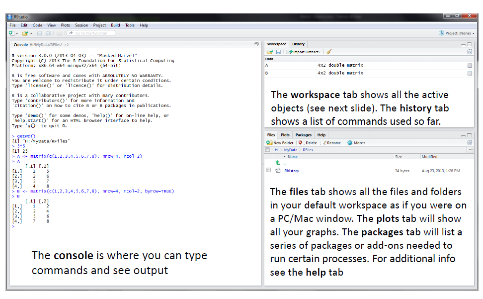
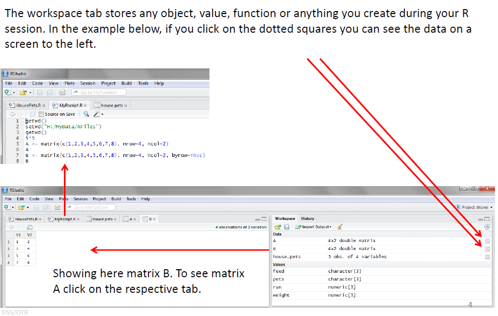
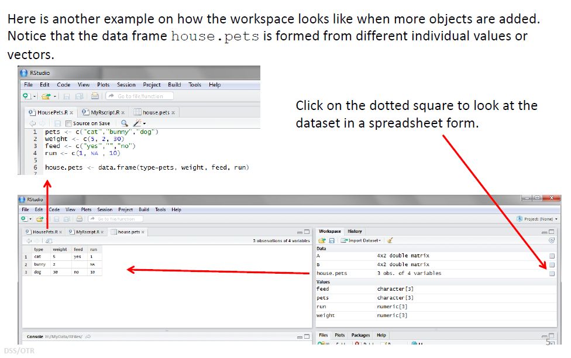
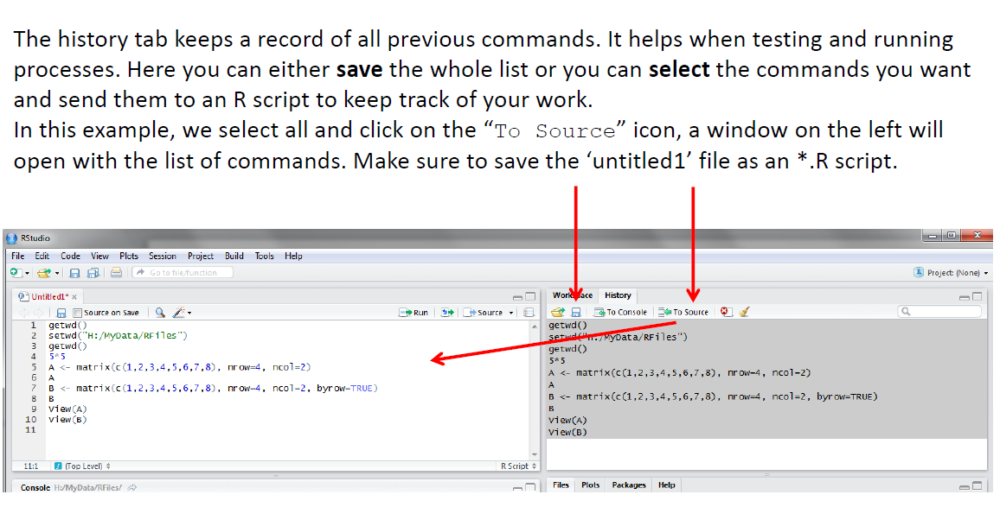
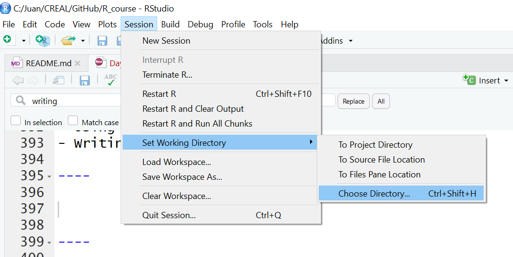
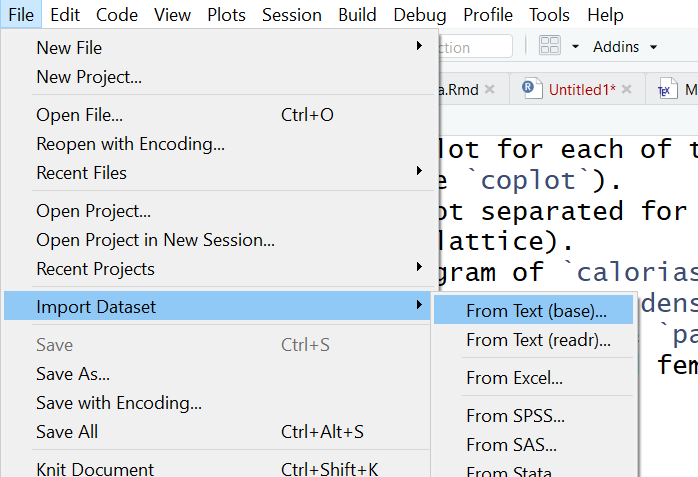
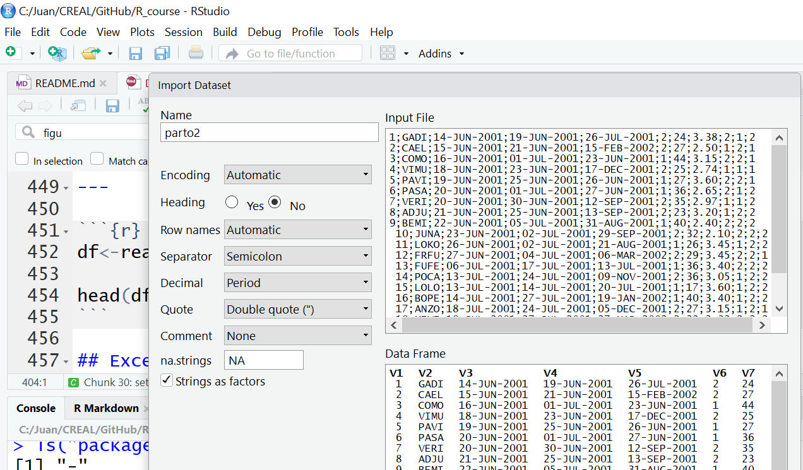
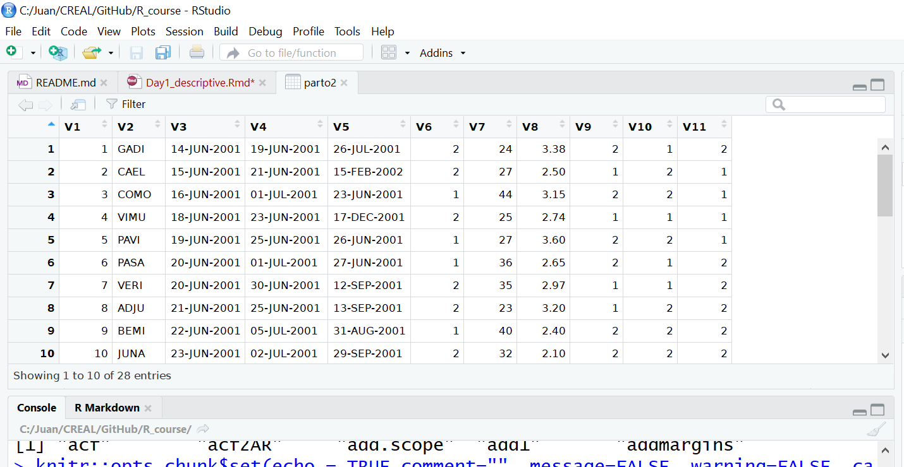

```{r setup, include=FALSE}
knitr::opts_chunk$set(echo = TRUE,comment="", message=FALSE, warning=FALSE, cache=TRUE, fig.width = 4, fig.height = 4)
options(width=80)
```

# Getting started

## Installing R and RStudio

- [R:](https://cran.rstudio.com/) https://cran.rstudio.com/
- [RStudio:](https://www.rstudio.com/products/rstudio/download/) https://www.rstudio.com/products/rstudio/download/

# RStudio

## Installing R and RStudio
Working with R is primarily text-based. The basic mode of use for R is that the user types in a command in the R language and presses enter, and then R computes and displays the result.

We will be working in [RStudio](https://www.rstudio.com/products/rstudio/download/). This surrounds the *console*, where one enters commands and views the results, with various conveniences. In addition to the console, RStudio provides panels containing:

* A *text editor*, where R commands can be recorded for future reference.
* A history of commands that have been typed on the console.
* An "environment" panel with a list of *variables*, which contain values that R has been told to save from previous commands.
* A file manager.
* Help on the functions available in R.
* A panel to show plots (graphs).


## RStudio screen




## Worspace tab (1)




## Workspace tab (2)




## History tab



# R basics

## The console
Open RStudio, click on the "Console" panel, type `1+1` and press enter. R displays the result of the calculation. In this document, we will be showing such an interaction with R as below.

```{r}
1+1
```

`+` is called an operator. R has the operators you would expect for for basic mathematics: `+` `-` `*` `/` `^`. It also has operators that do more obscure things.

`*` has higher precedence than `+`.  We can use brackets  `( )`, if necessary. Try `1+2*3` and `(1+2)*3`.

Spaces can be used to make code easier to read.

## Comparisons

We can compare with `== < > <= >=`. This produces a "logical" value, `TRUE` or `FALSE`. Note the double equals, `==`, for equality comparison.

```{r}
2 * 2 == 4
```

There are also character strings such as `"string"`.


## Variables

A variable is a name for a value, such as `x`, `current_temperature`, or `subject.id`. We can create a new variable by assigning a value to it using `<-`.

```{r}
weight_kg <- 55
```

RStudio helpfully shows us the variable in the "Environment" panel. We can also print it by typing the name of the variable and hitting enter.
In general, R will print to the console any object returned by a function or operation *unless* we assign it to a variable.

```{r}
weight_kg
```

Examples of valid variables names: `hello`, `hello_there`, `hello.there`, `value1`. Spaces aren't ok *inside* variable names. Dots (`.`) are ok, unlike in many other languages.


## Aritmetics

We can do arithmetic with the variable:

```{r}
# weight in pounds:
2.2 * weight_kg
```

> ### Tip {.callout}
>
> **NOTE:** It is highly recommended writing in scripts (File -> New File -> R script) - not in the console. There are tabs and keys to facilitate code execution (Ctrl + Intro).

> We can add comments to our code using the `#` character. It is useful to
> document our code in this way so that others (and us the next time we
> read it) have an easier time following what the code is doing.


## Vectors

A *vector* of numbers is a collection of numbers. We call the individual numbers *elements* of the vector. We can make vectors with `c( )`, for example `c(1,2,3)`. `c` means "combine". In R, numbers are just vectors of length one. R is a 'vectorize' language

```{r}
myvec <- c(10,20,30,40,50)
myvec + 1
myvec + myvec
```

## Vectors (2)

```{r}
c(myvec, myvec)
c(60, myvec)
length(myvec)
```
When we talk about the length of a vector, we are talking about the number of numbers in the vector.


## Types of vector

We will also encounter vectors of character strings, for example `"hello"` or `c("hello","world")`. Also we will encounter "logical" vectors, which contain `TRUE` and `FALSE` values. R also has "factors", which are categorical vectors, and behave very much like character vectors (think the factors in an experiment).


A categorical vector, where the elements can be one of several different "levels". There will be more on these in other sections.

```{r}
factor(c("mutant","wildtype","mutant"), 
       levels=c("wildtype","mutant"))
```


## Indexing vectors

Access elements of a vector with `[ ]`, for example `myvec[1]` to get the first element. You can also assign to a specific element of a vector.

```{r}
myvec[1]
myvec[2]
myvec[2] <- 5
myvec
```

## Indexing vectors (2)

Can we use a vector to index another vector? Yes!

```{r}
myind <- c(4,3,2)
myvec[myind]
```

We could equivalently have written

```{r}
myvec[c(4,3,2)]
```

## Slicing

Sometimes we want a contiguous *slice* from a vector.

```{r}
myvec[3:5]
```

`:` here actually creates a vector, which is then used to index `myvec`. `:` is pretty useful on its own too.

```{r}
3:5
1:50
numbers <- 1:10
numbers*numbers
```

## Slicing (2)

Now we can see why R always puts a `[1]` in its output: it is indicating that the first element of the vector can be accessed with `[1]`. Subsequent lines show the appropriate index to access the first number in the line.


## matrix

A matrix is a two dimensional tabular data structure in which all the elements are the same type. We will typically be dealing with numeric matrices, but it is also possible to have character or logical matrices, etc. Matrix rows and columns may have names (`rownames`, `colnames`).

Access an element: `mat[3,5]` `mat["arowname","acolumnname"]`

Get a whole row: `mat[3,]`

Get a whole column: `mat[,5]`

Creation: `matrix( )`


## data.frame

A data frame is a two dimensional tabular data structure in which the columns may have different types, but all the elements in each column must have the same type. Data frame rows and columns may have names (`rownames`, `colnames`). However in typical usage columns are named but rows are not.

Accessing elements, rows, and columns is the same as for matrices, but we can also get a whole column using `$`.

Creation: `data.frame(colname1=values1,colname2=values2,...)`


## Functions

R has various *functions*, such as `sum( )`. We can get help on a `sum` with `?sum`.

```
?sum
```

```{r}
sum(myvec)
```

Here we have *called* the function `sum` with the *argument* `myvec`.

Because R is a language for statistics, it has many built in statistics-related functions. We will also be loading more specialized functions from "libraries" (also known as "packages").


## Functions (2)

Some functions take more than one argument. Let's look at the function `rep`, which means "repeat", and which can take a variety of different arguments. In the simplest case, it takes a value and the number of times to repeat that value.

```{r}
rep(42, 10)
```

As with many functions in R---which is obsessed with vectors---the thing to be repeated can be a vector with multiple elements.

```{r}
rep(c(1,2,3), 10)
```

## Functions (3)

So far we have used *positional* arguments, where R determines which argument is which by the order in which they are given. We can also give arguments by *name*. For example, the above is equivalent to

```{r}
rep(c(1,2,3), times=10)
rep(x=c(1,2,3), 10)
rep(x=c(1,2,3), times=10)
```


## Functions (4)

Arguments can have default values, and a function may have many different possible arguments that make it do obscure things. For example, `rep` can also take an argument `each=`. It's typical for a function to be invoked with some number of positional arguments, which are always given, plus some less commonly used arguments, typically given by name.

```{r}
rep(c(1,2,3), each=3)
rep(c(1,2,3), each=3, times=5)
```

## Lists

Vectors contain all the same kind of thing. *Lists* can contain different kinds of thing. Lists can even contain vectors or other lists as elements.

We generally give the things in a list names. Try `list(num=42, greeting="hello")`. To access named elements we use `$`.

```{r}
mylist <- list(num=42, greeting="Hello, world")
mylist$greeting
mylist[[2]]
```

Functions that need to return multiple outputs often do so as a list.


## Data types

We've seen several data types in this chapter, and will be seeing two more in the following chapters. This section serves as an overview of data types in R and their typical usage.

Each data type has various ways it can be created and various ways it can be accessed. If we have data in the wrong type, there are functions to  "cast" it to the right type.

This will all make more sense once you have seen these data types in action.

> ### Tip {.callout}
>
> If you're not sure what type of value you are dealing with you can use `class`, or for more detailed information `str` (structure). Try the following:
>
> ```{r eval=FALSE}
> class(myvec)
> class(mylist)
> str(mylist)
> ```
>

## Miscellanea

- One can be interested in looking at all the available objects 

```{r}
ls()
``` 

- or removing one object

```{r}
rm(myvec)
ls()
```

- or knowing the packages that are loaded

```{r}
search()
```

----

The functions from a loaded package can be seen by

```{r}
ls("package:stats")[1:10]
```


# Installing packages

## Install and load packages

A package must be loaded before using a given function

```{r, eval=FALSE}
> spss.get
Error: object 'spss.get' not found
``` 

From CRAN (copy & paste - are required for the course):

```{r eval=FALSE}
install.packages(c("devtools", "foreign", "Hmisc", "readxl", 
                   "readstata13", "Epi", "car"))
```

From GitHub:

```{r eval=FALSE}
library(devtools)
install_github("isglobal-brge/SNPassoc")
```

The functions can also be used without loading the package by:
```{r eval=FALSE}
devtools::install_github("isglobal-brge/SNPassoc")
```


# Dealing with working directories

## Working directories
```{r}
getwd()
```
There are two ways of changing workin directory

- Using tabs from menu
- Writing R code

---




---

```{r setwd}
setwd("c:/Juan/CREAL/GitHub/R_course")

ff <- "c:/Juan/CREAL/GitHub/R_course/Day1-Introduction"
dir(ff)
dir("data")
file.path(ff, "data/parto2.dat")
```

# Getting data into R - import data

## Using `data` function

Most R packages contain `data.frames` to illustrative purposes. These data can be loaded into R using  `data` function. For instance:

```{r}
data(CO2, package="datasets")
head(CO2)
```


## Required packages

- \color{blue}`foreign`\color{black}: ~ import/export from SPSS, STATA, SAS,...

- \color{blue}`RODBC`\color{black}: ~ SQL or ACCESS data bases.

- \color{blue}`Hmisc`\color{black}: ~ SPSS, Hmisc (64bits).

- \color{blue}`readxl`\color{black}: ~ export/import Excel files. 

```{r}
library(foreign)
library(Hmisc)
library(readxl)
```


## ASCII files

- `sep`: column/variable separator character
- `header`: first row contains variable names?
- `as.is`: convert character to factor variables?

---




---



---



---

```{r}
df<-read.table("data/parto2.dat", sep=";", as.is=TRUE, 
               header=FALSE)
head(df)
```

## Excel

Use `read_excel` from `readxl` package.

```{r}
df<-read_excel("data/mujeres.xlsx")
class(df)
class(df) <- "data.frame"
head(df)
```


## Stata

- To read Stata files (.dta), use `read.dta` function from `foreign` package

```{r}
df <- read.dta("data/partoFin.dta",
             convert.dates = TRUE, convert.factors = TRUE)
head(df)
```

- Stata version >12 are not supported. You can use `readstata13`

```{r, eval=FALSE}
library(readstata13)
df <- read.dta13("data/partoFin.dta",
             convert.dates = TRUE, convert.factors = TRUE)
````


## SPSS

- To read SPSS (.sav) files, use `spss.get` function from `Hmisc` package.

- `use.value.labels`: return the label instead of codes.

- `datevars`: specify date format variables.

```{r}
df <- spss.get("data/parto2.sav",use.value.labels=TRUE, allow="_", 
             datevars=c("dia_nac","dia_entr","ulti_lac"))
head(df)
```


# Export data

## ASCII, Excel, Stata

- ASCII file

```{r, eval=FALSE}
write.table(df,"parto2ex.dat")
```

- Stata

```{r, eval=FALSE}
write.dta(df, file="c:/juan/data/bd.dta"), version=7L)
save.dta13(df, file="c:/juan/data/bd.dta")
```

- Objects

Save:
```{r, eval=FALSE}
save(df, file="c:/juan/data/bd.Rdata")) # or .rda
```

Load:
```{r, eval=FALSE}
load("c:/juan/data/bd.Rdata")) # an object df will be in R
```

# Descriptive analysis

## Read the data


- Read the data from a SPSS data file
- `Hmisc` package is required

```{r}
library(Hmisc)
df <- spss.get("data/partoFin.sav", allow="_", 
               datevars=c("dia_nac", "dia_entr", "ulti_lac"))
```

- Let us a look at first rows

```{r}
head(df)
```
---

- Let us see the type of variables we have

```{r}
str(df)
```

---

- Also it is possible to visualize data like a 'spreadsheet'

```{r, eval=FALSE}
View(df)
```


## Creating new variables

```{r}
df$edad2 <- df$edad*df$edad
```


```{r}
df$edad.c <- cut(df$edad, c(-Inf, 20, 25, Inf),
                 labels=c("low", "med", "high"))
table(df$edad.c)
```

```{r}
df$edad.c2 <- cut(df$edad, seq(0,50,5))
table(df$edad.c2)
```

```{r}
df$edad.c3 <- cut(df$edad, quantile(df$edad),
                  label=c("1st", "2nd", "3rd", "4th"))
table(df$edad.c3)
```

## Dealing with factor variables

- Recode

```{r}
table(df$naci_ca)
levels(df$naci_ca)
df$naci_ca2 <- df$naci_ca
levels(df$naci_ca2) <- c("Espa?ola", "Extranjero", "Extranjero")
table(df$naci_ca2)
```
---

- Relevel
```{r}
df$naci_ca3 <- relevel(df$naci_ca2, 2)
table(df$naci_ca3)
```


## Explore data

- How many rows and variables

```{r}
nrow(df)
ncol(df)
```

- View names

```{r}
names(df)
```

---

- Summary of all variables

```{r}
summary(df)
```

## Select variables

- Select a variable by its name

```{r}
df$sexo
```

- Select a variable by its position

```{r}
df[,2]
```


---

- Select some variables by names

```{r}
df[,c("sexo", "peso", "edad")]
```

---

- Select some variables by position

```{r}
df[,c(1,3,5)]
```

## Select rows

- Select a row

```{r}
df[4,]
```
- Select rows

```{r}
df[4:10,]
```

---

- Select rows by a condition, use `subset`

```{r}
subset(df, sexo=="ni?a")
```


---

- More than one category

```{r}
table(df$naci_ca)
subset(df, naci_ca%in%c("Espa?ola", "Otras"))
```       


## Descriptives

- Mean

```{r}
mean(df$edad)
```

- Standard deviation

```{r}
sd(df$edad)
```

- Median

```{r}
median(df$edad)
```

- Others

```{r, eval=FALSE}
var, quantile, range, ...
```

--- 

- Continous variables

```{r}
g <- function(x)c(Mean=mean(x,na.rm=TRUE),
                  Median=median(x,na.rm=TRUE),
                  Sd=sd(x,na.rm=TRUE))
summary(peso~sexo+tx, data=df, fun = g)
```

---

- Categorical variables

```{r}
library(Epi)
stat.table(list(Sexo = sexo, Visitas = tx), list(N = count(), 
    `%` = percent(tx)), data = df, margins = T)
```

## Plots

- Histogram

```{r}
hist(df$peso, col="blue", breaks = 10, 
     main="Peso", xlab="")
```

---

- Barplot

_Note: The variable must be a factor o a character. If it is numeric (e.g. 0, 1) convert to a factor using `as.factor`._

```{r}
plot(df$sexo, col="darkgreen")
```

---

- Boxplot (I)

```{r}
boxplot(df$peso, ylab="Peso (kgs.)")
```

---

- Boxplot (II)

```{r}
boxplot(peso ~ sexo , data=df, col="red", 
        ylab="Peso (kgs.)", xlab="Sexo")
```

---

- Scatterplot


```{r}
plot(peso ~ edad, data=df, col=sexo, pch=19)
title("Weight by mother age")
legend("topright", c("boy","girl"), fill=c(1,2))
```

## Correlation

- Pearson correlation

```{r}
with(df, cor(peso, edad))
```     
     
- Spearman correlation

```{r}
with(df, cor(peso, edad, method="spearman"))
``` 

## Session info

```{r}
sessionInfo()
```

