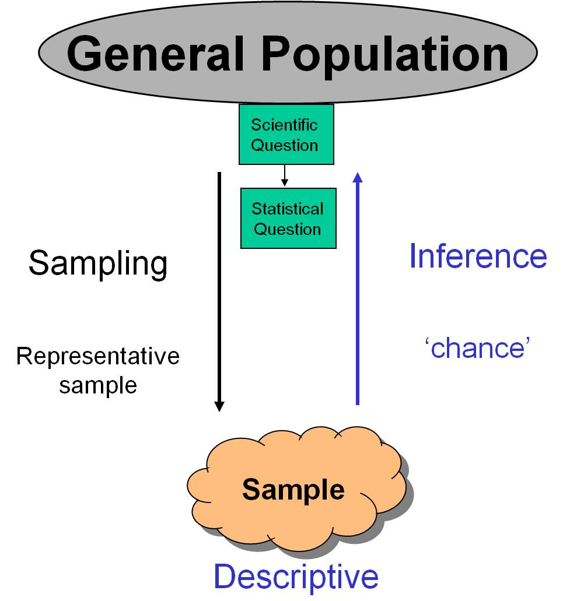
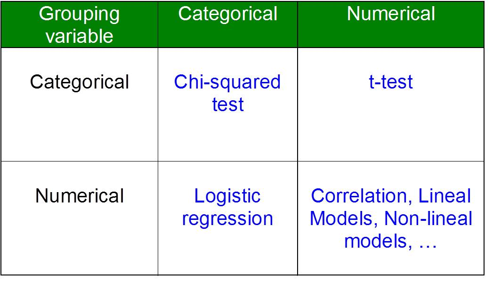
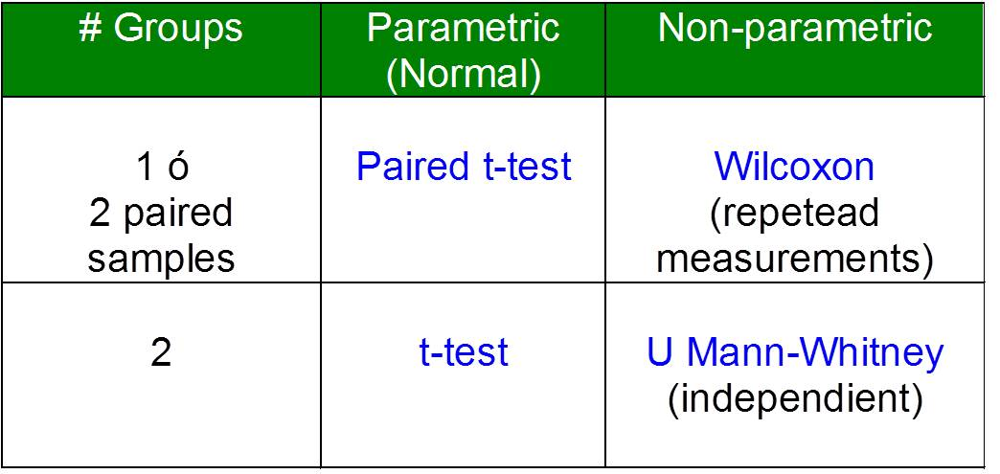
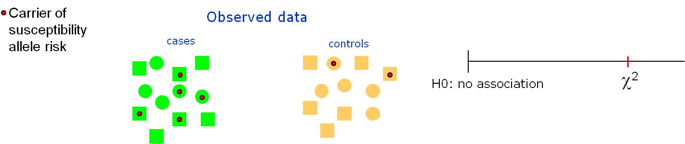
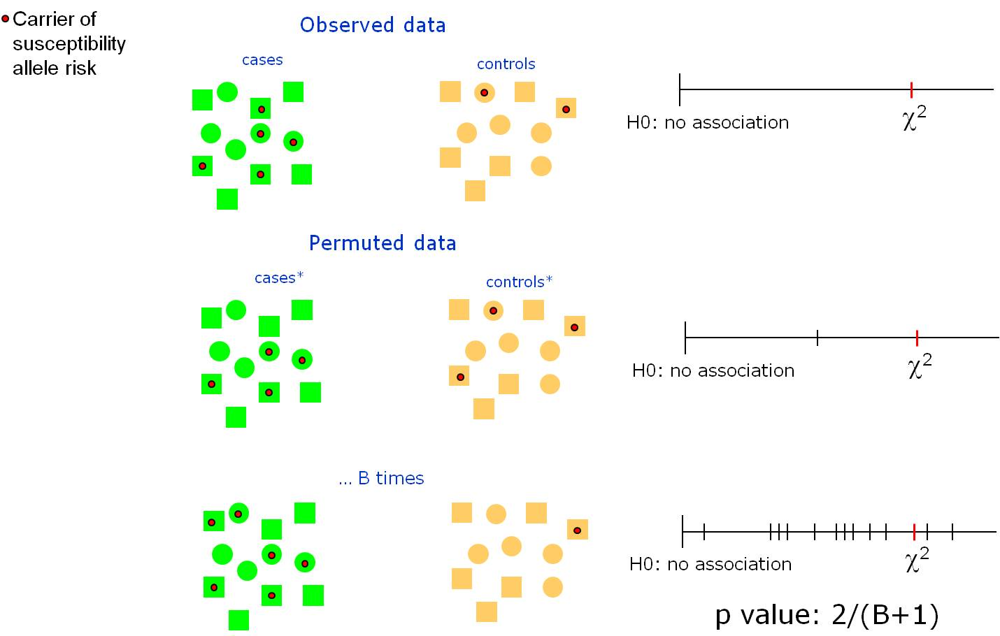

```{r setup, include=FALSE}
knitr::opts_chunk$set(echo = TRUE,comment="", message=FALSE, warning=FALSE, cache=TRUE, fig.width = 4, fig.height = 4)
options(width=80)
```


# Hypothesis testing

--- 

{height=200px}

## Tests (continuous variables)

```{r}
library(Hmisc)
df <- spss.get("data/partoFin.sav", allow="_", 
               datevars=c("dia_nac", "dia_entr", "ulti_lac"))
```


- One sample test

```{r}
t.test(df$peso, mu=4)
```

---

- Two independent sample test

\vspace{-0.3cm}

```{r}
t.test(peso ~ sexo, data=df)
```

- Paired t-test

\vspace{-0.3cm}

```{r}
t.test(df$horas_an, df$horas_de, paired = TRUE)
```
---

- ANOVA (more than 2 groups)

```{r}
mod <- aov(peso ~ naci_ca, data=df)
summary(mod)
```
```{r}
mod <- aov(peso ~ naci_ca + sexo, data=df)
summary(mod)
```

## Post-hoc

- None

\vspace{-0.3cm}

```{r}
with(df, pairwise.t.test(peso, naci_ca , p.adjust="none"))
```

- Bonferroni

\vspace{-0.3cm}

```{r}
with(df, pairwise.t.test(peso, naci_ca, p.adjust="bonf"))
```

- Holm

\vspace{-0.3cm}

```{r}
with(df, pairwise.t.test(peso, naci_ca, p.adjust="holm"))
```

--- 

- Tukey

```{r}
TukeyHSD(mod)
```

## Outliers

Analyzing data with outliers may influence the value of a (non-robust) statistic. We can test the null-hypothesis that a variable does not contain 
**an** outlier. Under the assumption that the data are realizations of one and the same distribution, such a hypothesis can be tested by the Grubbs (1950) test.
This test is based on the statistic $g =|suspect value- \bar{x}|/s$, where the suspect value is included for the computation of the 
mean $\bar{x}$ and the standard deviation $s$.

```{r}
library(outliers) 
grubbs.test(df$peso)
```
Since the p-value is not lower than 0.05, the conclusion is that there are no evidences to reject the null- hypothesis of no outliers.


## Non-parametric tests

- Wilcoxon test (U Mann Withney)

\vspace{-0.3cm}

```{r}
wilcox.test(peso ~ sexo, data=df)
```

- Krusdall-Wallis (More than two groups)

\vspace{-0.3cm}

```{r}
kruskal.test(peso ~ naci_ca, data=df)
```


## Two proporions

- Chi-square test

```{r}
freq <- with(df, table(sexo, tip_par))
chisq.test(freq)
```

---

- Fisher test

```{r}
freq <- with(df, table(sexo, tip_par))
fisher.test(freq)
```

## Correlation

- Pearson correlation test

\vspace{-0.2cm}

```{r}
cor.test(df$peso, df$edad)
```

- Spearman correlation test

\vspace{-0.2cm}

```{r}
cor.test(df$peso, df$edad, method="spearman")
```

---

{height=200px}

---

{height=200px}

## Permutation tests (**Advanced**)

Some times parametric tests cannot be applied, since there is not known distribution. Therefore, Monte Carlo-based
methods can be used instead:


---



---



---

Let's assume that you are interested in knowing whether there are differences in the *median absolute deviation* ($|x-\mbox{median}(x)|$) of breastfeeding weeks depending on the type of visits (intensive vs standard). How will you get a p-value? 

```{r}
B <- 10000
stat.ref <- mad(df$sem_lac[df$tx=="Intensivo"]) - 
            mad(df$sem_lac[df$tx=="Estándar"])
stat <- rep(NA, B)
for (i in 1:B) {
 tx.r <- sample(df$tx, nrow(df), replace=FALSE)
 stat[i] <- mad(df$sem_lac[tx.r=="Intensivo"]) - 
            mad(df$sem_lac[tx.r=="Estándar"])
}
```
---

```{r}
df$tx
tx.r
pvalue <- sum(stat>stat.ref)/(B+1)
pvalue
```


---

```{r}
hist(stat)
abline(v=stat.ref, col="red")
```

--- 

```{r}
t.test(sem_lac ~ tx, data=df)
```

---

```{r}
hist(df$sem_lac, col="blue")
```

## Session info

```{r}
sessionInfo()
```

