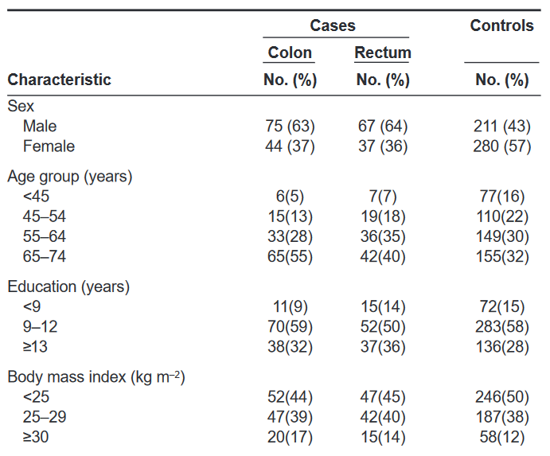
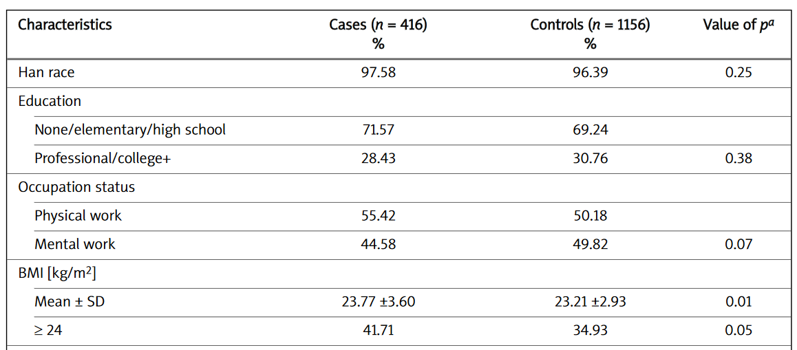
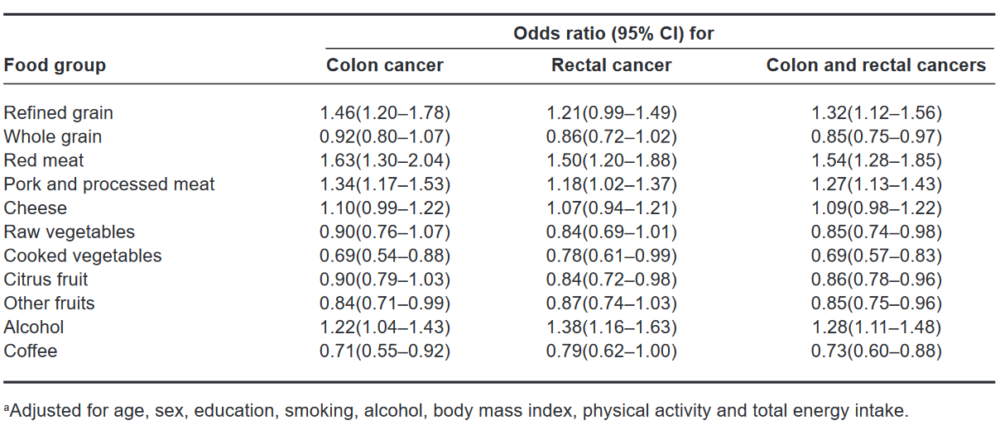
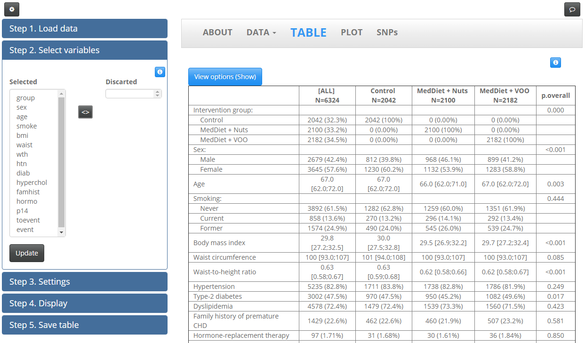

```{r setup, include=FALSE}
library(knitr)
knitr::opts_chunk$set(echo = TRUE,comment="", message=FALSE, warning=FALSE, cache=TRUE, fig.width = 4, fig.height = 4)
options(width=80)
```

# R facilitates data description and reproducible research

- Baseline description




---

- Patients characteristics comparision



---

- Odds ratio estimation




## compareGroups

`compareGroups` is an R package available on CRAN to create descriptive tables

It consists of three key funcions:

1. \color{blue}`compareGroups`\color{black} ~ generates all the calculation

2. \color{blue}`createTable`\color{black} ~ creates the descriptive table obtained by `compareGroups`. You can costumize it by excluding categories, number of decimals, etc.

3. \color{blue}`export2...`\color{black} ~ exports the descriptive table obtained by `createTable` to EXCEL, Word, LaTeX, Rmarkdown, etc.


## Example

**PREDIMED project:** \url{http://www.cat.isciii.es/ISCIII/es/contenidos/fd-el-instituto/fd-comunicacion/fd-noticias/PREDIMED-2013.pdf}

1. Load the package and the example data existing in `compareGroups` package

```{r, results="hide"}
library(compareGroups)
data(predimed)
# ?predimed
```

```{r}
head(predimed)
```

---

2. Compute descriptives and other figures by treatment group

- Use of formula environment to select variables.

- On left hand side write the variable indicating groups (nothing indicates that descriptive analyses will be performed for the whole database). 

- On the right side write all the variables you want to describe by the grouping variable 


```{r}
descr <- compareGroups(group ~ sex + age + smoke, predimed,
                       method=1) # method = 1 default
descr
```

---

- method = 1 forces analysis as "normal-distributed";
- method = 2 forces analysis as "continuous non-normal"; 
- method = 3 forces analysis as "categorical"; and 
- method = NA, which performs a Shapiro-Wilks test (similar to `ks.test`) to decide between normal or non-normal.


```{r}
descr <- compareGroups(group ~ sex + age + smoke, predimed,
                       method=NA)
descr
```

---

- If you are interested in describing all variables use '.'

```{r}
descr <- compareGroups(group ~ ., predimed)
descr
```

---

- If you are inerested in describing all variables but a subset of them use '-' (this is useful when having variables such us 'id', 'hc', 'name', ...)


```{r}
descr2 <- compareGroups(group ~ . -sex -age -event, predimed)
descr2
```


---

3. Build the descriptive table. 


```{r}
descrtable <- createTable(descr)
descrtable
```

## Customizing results

- Hide 'No' category

```{r}
update(descrtable, hide.no='no')
```
---

- Show number of valid data

```{r}
update(descrtable, hide.no='no', show.n = TRUE)
```

---

- Show only relative percentages

```{r}
update(descrtable, hide.no='no', show.n = TRUE, type=1)
```

## Customizing descriptives (tests)

- By default, `compareGroups` report means and SD, and performs t-test or ANOVA for continous variables.

- To report medians and quartiles and perform Kruskall-Wallis tests for continuous variable:

```{r}
descr <- update(descr, method=2)
createTable(descr, hide.no="no")
```

---

- Change number of decimals

```{r}
update(descrtable, hide.no='no', digits=1, digits.p=5)
```


---

- Perform medians and quantiles for some variables:

```{r}
descr <- update(descr, method=c(age=2, p14=2))
createTable(descr, hide.no="no")
```


## Odds Ratio


- Place the case/control variable on left hand side. 

- It computes the Odds Ratio (OR) of being a case (second category). To change reference category, use `ref.y` argument from `compareGroups` function.

- Let's report the OR of being hyperchol

```{r}
table(predimed$hyperchol)
```

---

```{r}
descr <- compareGroups(hyperchol ~ ., predimed)
createTable(descr, hide.no="no", show.ratio=TRUE, 
            show.p.overall=FALSE, show.p.trend = FALSE)
```


## Hazard Ratios

- PREDIMED is a cohort study with time-to-event outcome.

- Descriptives by cases and controls, HR taking into account time-to-event response (with possible right censoring) and  and p-values are easily computed


---

1. First, create a `Surv` variable

```{r}
predimed$tevent <- with(predimed, Surv(toevent, event=="Yes"))
```

2. Then write this variable on left side of `~` in `compareGroups`.
Note the use of `-` to erase some variables.

```{r}
descr <- compareGroups(tevent ~ .- toevent-event, predimed)
createTable(descr, hide.no="no", show.ratio=TRUE, 
            show.p.overall=FALSE)
```

## Utilities

- use `label` function from Hmisc package to label variables

```{r}
Hmisc::label(predimed$age) <- "Age of participant"
```

- To know the original variable names (instead of labels)

```{r}
descrtable <- createTable(compareGroups(group ~ ., predimed))
varinfo(descrtable)
```

---

- To select some variables use `[]`, indexing by names or by position

```{r}
descrtable <- createTable(compareGroups(group ~ ., predimed))
descrtable[c('age','bmi')]
descrtable[c(1,4)]
```


## Plotting variables

- Continuous univariate

```{r}
descr <- compareGroups(group ~ ., predimed)
plot(descr['bmi'])
```

---

- Continuous by groups

```{r}
plot(descr['bmi'], bivar=TRUE)
```

---

- Categorical variable

```{r}
plot(descr['sex'])
```


---

- Categorical by groups

```{r}
plot(descr['sex'], bivar=TRUE)
```

## Export

```{r, eval=FALSE}
# CSV
export2csv(descrtable, file="tabla.csv", sep=";")
# Excel
export2xls(descrtable, file="tabla.xlsx")
# Word
export2word(descrtable, file="tabla.docx")
# Latex
export2tex(descrtable, file="tabla.tex")
```

... or inside a **Rmarkdown** document chunk


```{r}
export2md(descrtable)
```


## More

- There exists much more options

- See `?compareGroups`, `?createTable`, ...

- Visit [compareGroups wepage](http://www.comparegroups.eu/)

- Application made with Shiny available [here](http://apps.datarus.eu/comparegroups/)

---




## Session info

```{r}
sessionInfo()
```

